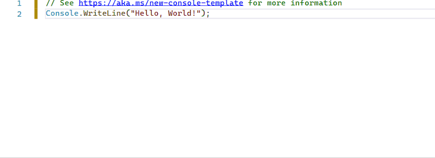

# 
Micro-framework for .NET **Co**re **con**sole **a**pplication. Cocona makes it easy and blazing-fast to build console applications on .NET Core.🚀

[](https://dev.azure.com/misuzilla/Cocona/_build/latest?definitionId=18&branchName=master) [](https://www.nuget.org/packages/Cocona)

### ⏱ Create a console application with Cocona in seconds.


## Feature
- 🚀 **Make it easy to build console applications on .NET Core.**
    - `public` method as a command ™
    - Provides ASP.NET Core MVC-like development experience to console application development.
- ✨ **Command-line option semantics like UNIX tools standard. (`getopt`/`getopt_long` like options)**
    - Your app can handle both `-rf /` and `-r -f /` :-)
    - Support single command and multiple commands style
        - `myapp --foo --bar -n arg0 "arg1"` (e.g. `dir`, `cp`, `ls` ...)
        - `myapp server -m "Hello world!"` (e.g. `dotnet`, `git`, `kubectl` ...)
- ❓ **Built-in help documentation support.**
    - You want to see a help message; you type `-h` or `--help`.
    - Built-in similar commands suggestion
- 🛠 **Highly modulable/customizable CLI framework.**
    - Cocona built on top of `Microsoft.Extensions.*` framework. Cocona natively supports Logging, DI, Configuration and ConsoleLifetime.

[You can find sample code for various features.](samples)

## Table of contents
- [Installing](#installing)
- [Getting Started](#getting-started)
- [Command-line handling basics](#command-line-handling-basics)
    - [Command](#command)
    - [Options](#options)
    - [Arguments](#arguments)
    - [Sub-commands](#sub-commands)
- [Cocona in action](#cocona-in-action)
    - [Exit code](#exit-code)
    - [Shutdown event handling](#shutdown-event-handling)
    - [Command filter](#command-filter)
    - [Dependency Injection](#dependency-injection)
    - [Configuration](#configuration)
    - [Logging](#logging)
- [Advanced](#advanced)
    - [Help customization](#help-customization)
- [Related projects](#related-projects)
- [License](#license)

## Installing
Install NuGet package from NuGet.org

```sh
$ dotnet add package Cocona
```
```powershell
PS> Install-Package Cocona
```

## Getting Started

```csharp
using Cocona;
class Program
{
    static void Main(string[] args)
    {
        // Cocona parses command-line and executes a command.
        CoconaApp.Run<Program>(args);
    }

    // public method as a command ™
    public void Hello(string name)
    {
        Console.WriteLine($"Hello {name}");
    }
}
```

### Try to run!
```sh
$ dotnet run
Usage: ConsoleAppSample [--name <String>]

Options:
  --name <String>    (Required)
  -h, --help         Show help message
  --version          Show version

$ dotnet run -- --name Cocona
Hello Cocona
```

### Extra: Publish the application as a single-file executable
If your application runs on .NET Core 3.0 or later, you can publish the app as a single-file executable. (see. [What's new in .NET Core 3.0](https://docs.microsoft.com/en-us/dotnet/core/whats-new/dotnet-core-3-0#single-file-executables))
```sh
PS> dotnet publish -r win-x64 -p:PublishSingleFile=true
PS> app.exe --name Cocona

$ dotnet publish -r linux-x64 -p:PublishSingleFile=true
$ ./app --name Cocona
```

## Command-line handling basics
### Command
#### Public method as a command ™
By default, Cocona treats `public` methods as commands.

If an app has one public method, Cocona calls it on startup. If there are two or more, they are treated as sub-commands. (see also [Sub commands](#sub-commands))

```csharp
// Treats a method name as a command name. (Below method is named `command`)
public void Command() { ... }

// Specify a command name using CommandAttribute.
[Command("commandname")]
public void Command() { ... }

// Cocona will ignore this method.
[Ignore]
public void Ignored() { ... }
```

If you want to specify a method as a command manually, set `false` to `TreatPublicMethodsAsCommands` option at startup. All command methods require `CommandAttribute`.

```csharp
CoconaApp.Run<Program>(args, options =>
{
    // If the option value is `false`, All command methods require `CommandAttribute`.
    options.TreatPublicMethodsAsCommands = false;
});
```
### Options
Cocona exposes method parameters as command-line options (also known as flags).

```csharp
// This command accepts `--name <string>` and `--hey` options.
public void Hello(string name, bool hey) { ... }
```

If method parameters are [optional argument](https://docs.microsoft.com/en-us/dotnet/csharp/programming-guide/classes-and-structs/named-and-optional-arguments#optional-arguments), Cocona treats those as optional command options. (That is, the parameters are treated as **required option** by default excepts boolean).
If a type of parameter is boolean, it's assumed that `false` default value is specified.

```csharp
// `--name "default user"` is specified implicity.
public void Hello(string name = "default user") { ... }
```

Do you want to use short-name option `-f` instead of `--force`?
You can specify short-name to an option using `OptionAttribute`.

```csharp
// The command accepts `-f` or `--force` option.
// Cocona's command-line parser accepts getopt-like styles. See below.
// $ remove --force --recursive
// $ remove -r -f
// $ remove -rf
public void Remove([Option('f')]bool force, [Option('r')bool recursive) { ... }
```

If a type of parameter is `T[]` or `IEnumerable<T>`, a command accepts one or more options by the same name.
```csharp
// $ compile -I../path/to/foo.h -I/usr/include/bar.h -I/usr/include/baz.h nantoka.c
// include = new [] { "../path/to/foo.h", "/usr/include/bar.h", "/usr/include/baz.h" };
public void Compile([Option('I')]string[] include, [Argument]string file) { ... }
```

- See also: [CoconaSample.InAction.CommandOptions](samples/InAction.CommandOptions)

### Arguments
Command-line arguments are defined as method parameters as same as options.

```csharp
// ./app alice karen
public void Hello([Argument]string from, [Argument]string to) { ... }
```

You can define a parameter as `T[]`. It allows defining `cp`-like command which accepts many file paths and one destination path (`cp file1 file2 file3 dest`).

```csharp
// ./copy file1 file2 file3 dest
public void Copy([Argument]string[] src, [Argument]string dest) { ... }
```

- See also: [CoconaSample.InAction.ManyArguments](samples/InAction.ManyArguments)

### Sub-commands
If a command type has more than one public method or `[Command]`, those commands are exposed as sub-commands. You can implement an application that has sub-commands similar to `dotnet`, `git`, `kubectl` etc...

```csharp
static void Main(string[] args)
{
    CoconaApp.Run<Program>(args);
}

[Command(Description = "Say hello")]
public void Hello([Argument]string name)
{
    Console.WriteLine($"Hello {name}!");
}

[Command(Description = "Say goodbye")]
public void Bye([Argument]string name)
{
    Console.WriteLine($"Goodbye {name}!");
}
```

```bash
$ ./SubCommandApp
Usage: SubCommandApp [command]
Usage: SubCommandApp [--help] [--version]

SubCommandApp

Commands:
  hello    Say hello
  bye      Say goodbye

Options:
  -h, --help    Show help message
  --version     Show version
```

When a user mistypes a command, Cocona prints command autogenerated suggestions.

```bash
$ ./SubCommandApp hell
Error: 'hell' is not a command. See '--help' for usage.

Similar commands:
  hello
```

- See also: [CoconaSample.GettingStarted.SubCommandApp](samples/GettingStarted.SubCommandApp)

#### PrimaryCommand
```csharp
[PrimaryCommand]
public void Primary(bool foo, string bar) { ... }

[Command]
public void Hello() { ... }

[Command]
public void Goodbye() { ... }
```

## Cocona in action

### Exit code
```csharp
// Exit Code: 0
public void NoReturn() { }

// Exit Code: 123
public int Return() { return 123; }

// Exit Code: 255
public async Task<int> ReturnAsync() { return 255; }

// Exit Code: -1
public async ValueTask<int> ReturnValueTaskAsync() { return -1; }

// Exit Code: 128
public void Throw() { throw new CommandExitedException(128); }
```

- See also: [CoconaSample.InAction.ExitCode](samples/InAction.ExitCode)
### Shutdown event handling
```csharp
class Program : CoconaConsoleAppBase
{
    ...
    public async Task RunAsync()
    {
        while (!Context.CancellationToken.IsCancellationRequested)
        {
            await Task.Delay(100);
        }
    }
}
```

- See also: [CoconaSample.InAction.HandleShutdownSignal](samples/InAction.HandleShutdownSignal)

### Command filter
Cocona has filter mechanism like ASP.NET Core's action filter. Filters allow custom processing before or after you run a command.

- `ICommandFilter` interface
- `CommandFilterAttribute` attribute
- `IFilterProvider` interface
- `IFilterMetadata` interface

```csharp
class Program
{
    static void Main(string[] args)
    {
        CoconaApp.Run<Program>(args);
    }

    [SampleCommandFilter]
    public void Hello()
    {
        Console.WriteLine($"Hello Konnichiwa");
    }
}

class SampleCommandFilterAttribute : CommandFilterAttribute
{
    public override async ValueTask<int> OnCommandExecutionAsync(CoconaCommandExecutingContext ctx, CommandExecutionDelegate next)
    {
        Console.WriteLine($"Before Command: {ctx.Command.Name}");
        try
        {
            return await next(ctx);
        }
        finally
        {
            Console.WriteLine($"End Command: {ctx.Command.Name}");
        }
    }
}
```

- See also: [CoconaSample.InAction.CommandFilter](samples/InAction.CommandFilter)

### Dependency Injection
```csharp
class Program
{
    public Program(ILogger<Program> logger)
    {
        logger.LogInformation("Create Instance");
    }

    static void Main(string[] args)
    {
        CoconaApp.Create()
            .ConfigureServices(services =>
            {
                services.AddTransient<MyService>();
            })
            .Run<Program>(args);
    }

    public void Hello([FromService]MyService myService)
    {
        myService.Hello("Hello Konnichiwa!");
    }
}

class MyService
{
    private readonly ILogger _logger;

    public MyService(ILogger<MyService> logger)
    {
        _logger = logger;
    }

    public void Hello(string message)
    {
        _logger.LogInformation(message);
    }
}
```

- See also: [CoconaSample.InAction.DependencyInjection](samples/InAction.DependencyInjection)

### Configuration
- See also: [CoconaSample.InAction.AppConfiguration](samples/InAction.AppConfiguration)

### Logging
```csharp
class Program : CoconaConsoleAppBase
{
    ...
    public async Task RunAsync()
    {
        Context.Logger.LogInformation("Hello Konnichiwa!");
    }
}
```
## Advanced
### Help customization
- See also: [CoconaSample.Advanced.HelpTransformer](samples/Advanced.HelpTransformer)

## Related projects
- [Cysharp/ConsoleAppFramework](https://github.com/Cysharp/ConsoleAppFramework): It heavily inspired Cocona.

## License
MIT License
```
Copyright © 2020-present Mayuki Sawatari <mayuki@misuzilla.org>
```
